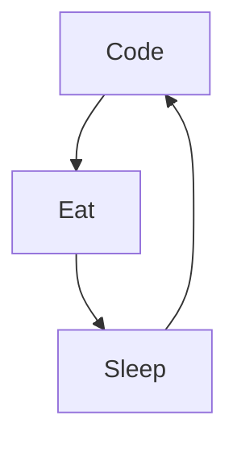

### Hi there 👋

# Kevin-Joel Agbeto

I am a software engineer with a passion for creating innovative, high-performance products. I have a strong background in large-scale software development, as well as in managing complex technical projects.

Here are some ideas to get you started:

- 🔭 I’m currently working on AI application
- 🌱 I’m currently learning AI, prompt engineering and amazing thing
- 👯 I’m looking to collaborate on innovative projects, development of solid and sustainable solution in IT
- 📫 How to reach me: Linkedin or email
- ⚡ Fun fact: Naruto is the best manga in the world

### Connect with me:

&nbsp;&nbsp;

&nbsp;&nbsp;

&nbsp;&nbsp;

### Languages and tools:

 
 

### My daily routine:

### ⭐ GitHub Stats

